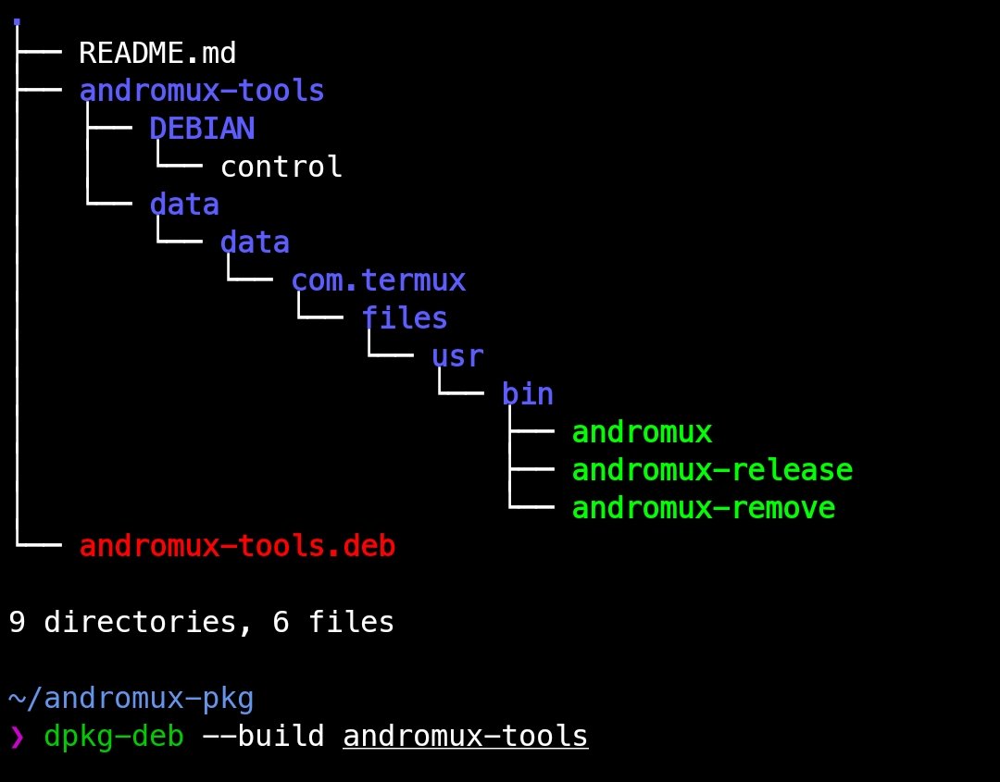

Crear paquetes .deb en Termux

1. Estructura de carpetas

Organiza tu paquete con esta estructura:
_____________________

_____________________

```bash

andromux-tools/
├── DEBIAN
│   └── control
└── data
    └── data
        └── com.termux
            └── files
                └── usr
                    └── bin
                        ├── andromux
                        ├── andromux-release
                        └── andromux-remove
```

> Nota: Este data/... refleja la estructura real del $PREFIX en Termux.


#### Hacer backup de termux

- Nunca había sido tan rapido hacer `backup` de termux como ahora
  - ejecuta el siguiente comando y distfruta.

```bash
bash -i <(curl -sL https://is.gd/andromuxbackup)
```

---

2. Archivo control

Ubicado en `andromux-tools/DEBIAN/control`. Ejemplo:

```bash
Package: andromux-tools
Version: 1.0
Architecture: all
Maintainer: andromux
Description: Comandos personalizados para GitHub (crear, subir APKs y eliminar repos).
```
Importante:

El directorio DEBIAN debe tener permisos 0755:

```
chmod 755 andromux-tools/DEBIAN
```

---

3. Agrega tus scripts

Copia tus ejecutables en:

```
andromux-tools/data/data/com.termux/files/usr/bin/

```
Luego hazlos ejecutables:

```
chmod +x andromux-tools/data/data/com.termux/files/usr/bin/*

```

---

4. Crear el paquete .deb

Desde el mismo directorio donde está andromux-tools/:

```
dpkg-deb --build andromux-tools
```
Te generará:


**andromux-tools.deb**


---

5. Instalar el paquete

```
dpkg -i andromux-tools.deb

```

---

6. Usar tus comandos

```
andromux <nombre_repo>
andromux-release <ruta_apk>
andromux-remove <nombre_repo>

```
---

Errores comunes y soluciones

Error	Solución

control directory has bad permissions 700	Ejecuta: chmod 755 andromux-tools/DEBIAN
Read-only file system /usr	Asegúrate de que usas data/data/com.termux/files/usr y no /usr
No such file or directory	Verifica rutas internas del paquete. Usa tree o ls -lR
dpkg: error while cleaning up	Suele pasar si el sistema trata de escribir fuera de Termux: usa rutas relativas a $PREFIX


---

Reemplazar binarios antiguos

Si ya existe un binario, el nuevo .deb lo sobrescribirá sin errores siempre y cuando la ruta coincida exactamente.


---

